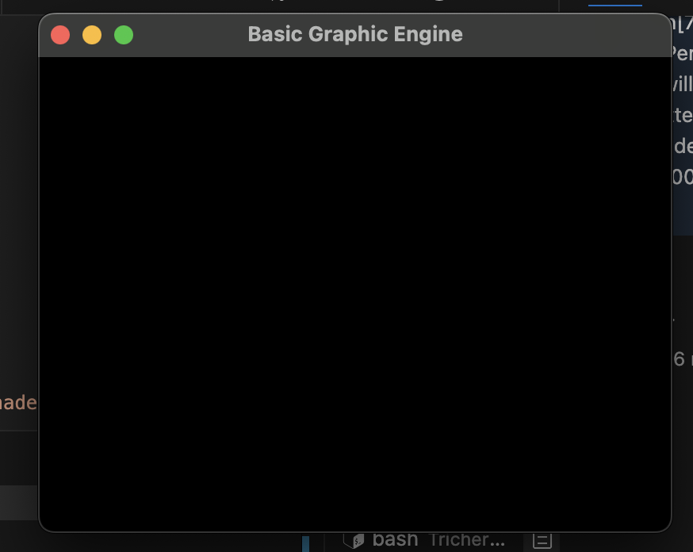
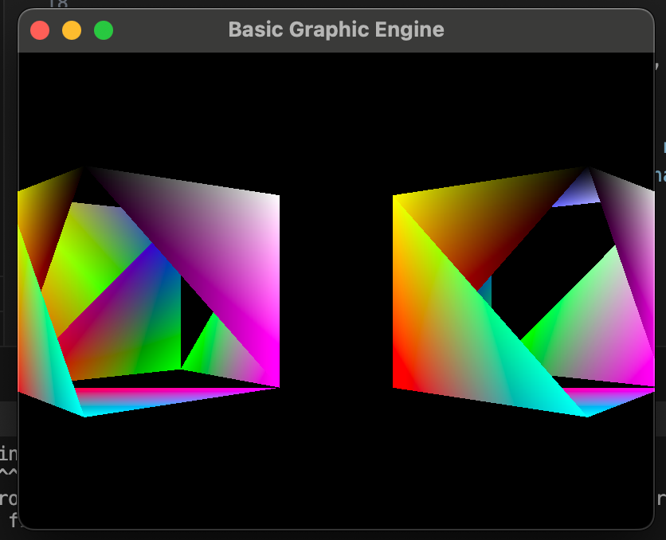
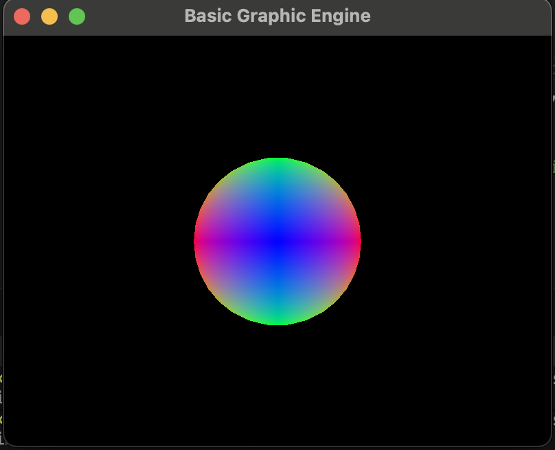

Mi ventana se ve negra porque, aunque los cubos están en la escena, no se están dibujando correctamente. Esto ocurre por dos razones principales:

1. No se está enviando la matriz MVP al shader
El shader espera una matriz uniform mat4 Mvp; para transformar los vértices de cada cubo.
Si no envío esta matriz, los vértices no se transforman correctamente y pueden quedar fuera de la vista o en posiciones incorrectas (invisibles).
Actualmente, mi código solo llama a vao.render() y no actualiza el uniform Mvp antes de dibujar cada cubo.
Solución:
Antes de renderizar cada cubo, debo calcular la matriz MVP y enviarla al shader:

2. No está activado el buffer de profundidad (depth test)
Sin el depth test, OpenGL dibuja los triángulos en el orden en que llegan, sin importar cuál está adelante o atrás.
Esto puede causar que las caras del cubo se dibujen mal, superponiéndose incorrectamente.
Solución:
Activar el depth test en cada frame:

## Respuestas a las preguntas de la guía
### ¿Qué ocurre si no se aplica la matriz de vista de la cámara?
Los objetos no se posicionan correctamente respecto a la cámara; no se "ven" desde el punto de vista deseado.

### ¿Y si omitimos la proyección?
No hay perspectiva: los objetos no se proyectan correctamente en 2D y pueden no verse o verse deformados.

### ¿Por qué necesitamos recalcular MVP para cada objeto?
Porque cada objeto tiene su propia posición, rotación y escala (modelo), y debe ser transformado individualmente respecto a la cámara y la proyección.

### ¿Qué debes hacer para que se vean los cubos?
En tu método render de la escena, tengo que calcular y envíar la matriz MVP para cada objeto antes de dibujarlo.
Activar el depth test en cada frame.

Esfera:
